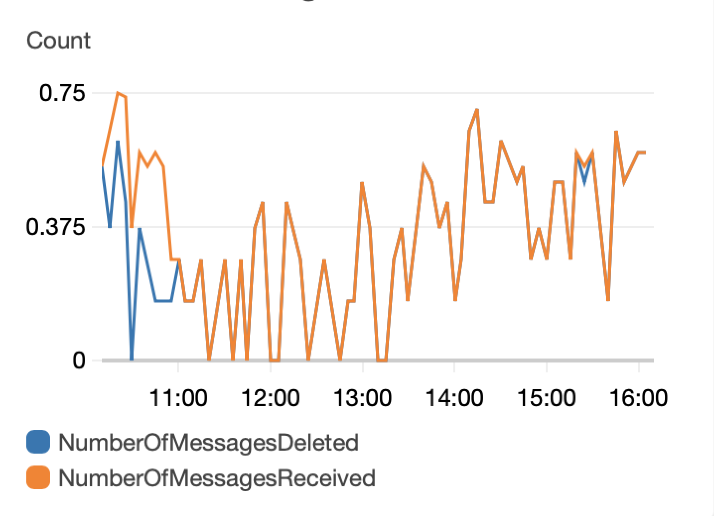
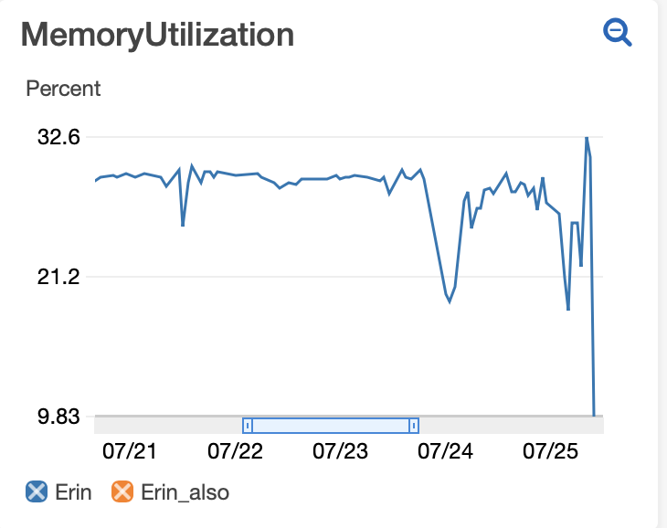
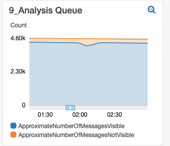
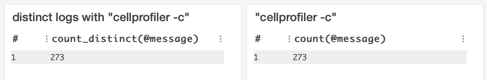
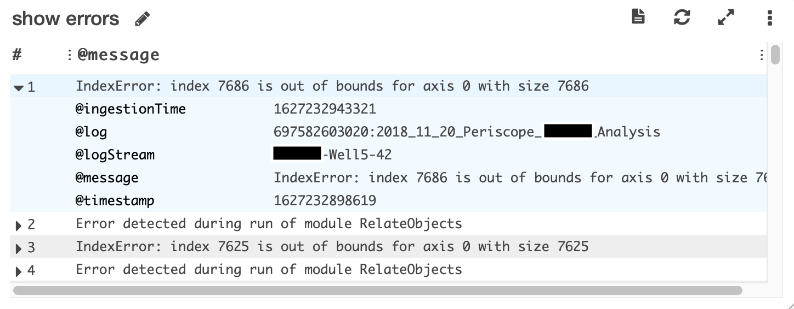

# AWS Cloudwatch Dashboard

AWS Cloudwatch Dashboards are “customizable home pages in the CloudWatch console that you can use to monitor your resources in a single view and create customized views of the metrics and alarms for your AWS resources.”
A Dashboard is full of widgets, each of which you create and customize to report on a separate AWS metric.
Distributed-CellProfiler has the option to auto-create a Cloudwatch Dashboard for each run and the option to clean it up when you are done.
These options are set in [your config file](step_1_configuration.md).

The Dashboard setup that DS auto-populates is helfpul for monitoring a run as it is occurring or for a post-mortem to better understand a previous run.
Some things you can see include: whether your machines are sized appropriately for your jobs, how stable your spot fleet is, whether your jobs are failing and if so if they’re failing in a consistent manner.
All told, this can help you understand and optimize your resource usage, thus saving you time and money

## FulfilledCapacity

This widget shows the number of machines in your spot fleet that are fulfilled, i.e. how many machines you actually have at any given point.
After a short spin-up time after initiating a run, you hope to see a straight line at the number of machines requested in your fleet and then a steady decrease at the end of a run as monitor scales your fleet down to match the remaining jobs.

Some number of small dips are all but inevitable as machines crash and are replaced or AWS takes some of your capacity and gives it to a higher bidder.
However, every time there is a dip, it means that a machine that was running a job is no longer running it and any progress on that job is lost.
The job will hang out as “Not Visible” in your SQS queue until it reaches the amount of time set by SQS_MESSAGE_VISIBILITY in [your config file](step_1_configuration.md).
For quick jobs, this doesn’t have much of an impact, but for jobs that take many hours, this can be frustrating and potentially expensive.

If you’re seeing lots of dips or very large dips, you may be able to prevent this in future runs by 1) requesting a different machine type 2) bidding a larger amount for your machines 3) changing regions.
You can also check if blips coincide with AWS outages, in which case there’s nothing you can do, it’s just bad luck (that’s what happened with the large dip in the example above).

## NumberOfMessagesReceived/Deleted

This widget shows you in bulk whether your jobs are completing or erroring.
NumberOfMessagesDeleted shows messages deleted from the queue after the job has successfully completed.
NumberOfMessagesReceived shows both messages that are deleted from the queue as well as messages that are put back in the queue because they errored.
You hope to see that the two lines track on top of each other because that means no messages are erroring.
If there are often gaps between the lines then it means a fraction of your jobs are erroring and you’ll need to figure out why (see MemoryUtilization and Show Errors or look directly in your Cloudwatch Logs for insights).

## MemoryUtilization

Insufficient memory is the error that we most often encounter (as we try to use the smallest machines possible for economy’s sake) so we like to look at memory usage.
Note that this is showing memory utilization in bulk for your cluster, not for individual machines.
Because different machines reach memory intensive steps at different points in time, and because we’re looking at an average across 5 minute windows, the max percentage you see is likely to be much less than 100%, even if you are using all the memory in your machines at some points.

## MessagesVisible/NotVisible

Visible messages are messages waiting in your queue.
Hidden messages (aka MessagesNotVisible) have been started and will remain hidden until either they are completed and therefore removed from the queue or they reach the time set in SQS_MESSAGE_VISIBILITY in your config file, whichever comes first.
([Read more about Message Visibility](SQS_QUEUE_information.md).)
After starting your fleet (and waiting long enough for at least one round of jobs to complete), you hope to see a linear decline in total messages with the number of hidden messages equal to the number of jobs being run (fleet size *tasks per machine* docker cores).

Sometimes you’ll see a blip where there is a rapid increase in the number of hidden messages (as pictured above).
This can happen if there is an error on a machine and the hard disk gets full - it rapidly pulls jobs and puts them back until the machine error is caught and rebooted.
This type of error shows in this widget as it happens.

If your spot fleet loses capacity (see FulfilledCapacity), you may see a blip in MessagesVisible/NotVisible where the number of hidden messages rapidly decreases.
This appears in the widget the amount of time set in SQS_MESSAGE_VISIBILITY in your config file after the capacity loss when jobs that were started (i.e. hidden) but not completed return to visible status.

The relative slope of your graph can also be informative.
For the run pictured at top, we discovered that a fraction of our jobs were erroring because the machines were running out of memory.
Midway through 7/12 we upped the memory of the machines in our fleet and you can see from that point on a greater slope as more jobs were finishing in the same amount of time (as fewer were failing to complete because of memory errors.)

As of v2.2.1, messages in your DeadLetter queue was added to the MessagesVisible/NotVisible stack so that you can see, when messages are no longer in the job queue, if they complete (disappear from graph) or fail (go to DeadLetter queue).

## Distinct Logs

This widget shows you the number of different specific jobs that start within your given time window by plotting the number of Cloudwatch logs that have your run command in them.
In this example, our run command is "cellprofiler -c".
It is not necessarily informative on its own, but very helpful when compared with the following widget.

## All logs

This widget shows you the number of total times that jobs are started within your log group within the given time window.
Ideally, you want this number to match the number in the previous widget as it means that each job is starting in your software only once.

If this number is consistently larger than the previous widget’s number, it could mean that some of your jobs are erroring and you’ll need to figure out why (see MemoryUtilization and Show Errors or look directly in your Cloudwatch Logs for insights).

## Show Errors

This widget shows you the log entry any time that it contains “Error”.
Ideally, this widget will remain empty.
If it is logging errors, you can toggle each row for more information - it will show the job that errored in @logStream and the actual error message in @message.

## Interacting with a Dashboard

Once you have your Dashboard created and full of widgets, you can adjust the timescale for which the widget is reporting metrics.
For any of the widgets you can set the absolute or relative time that the widget is showing by selecting the time scale from the upper right corner of the screen.
Zoom in to a particular time selection on a visible widget by drawing a box around that time on the widget itself (note that zooming in doesn’t change what’s plotted, just what part of the plot you can see so metrics like Show Errors won’t update with a zoom).

Some widgets allow you to select/deselect certain metrics plotted in the widget.
To hide a metric without permanently removing it from the widget, simply click the X on the box next to the name of the metric in the legend.

You can move the widgets around on your dashboard by hovering on the upper right or upper left corner of a widget until a 4-direction-arrow icon appears and then dragging and dropping the widget.
You can change the size of a widget by hovering on the lower right corner of the widget until a diagonal arrow icon appears and then dragging the widget to the desired size.
After making changes, make sure to select Save dashboard from the top menu so that they are maintained after refreshing the page.
