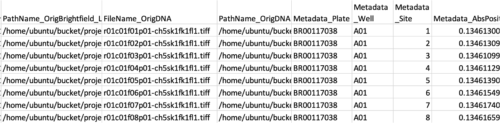

# Passing Files to DCP

Distributed-CellProfiler can be told what files to use through LoadData.csv, Batch Files, or file lists.

## Metadata use in DCP

Distributed-CellProfiler requires metadata and grouping in order to split jobs. This means that, unlikely a generic CellProfiler workflow, the inclusion of metadata and grouping are NOT optional for pipelines you wish to use in Distributed-CellProfiler. 
- If using LoadData, this means ensuring that your input CSV has some metadata to use for grouping and "Group images by metdata?" is set to "Yes". 
- If using batch files or file lists, this means ensuring that the Metadata and Groups modulles are enabled, and that you are extracting metadata from file and folder names _that will also be present in your remote system_ in the Metadata module in your CellProfiler pipeline. You can pass additional metadata to CellProfiler by `Add another extraction method`, setting the method to `Import from file` and setting Metadata file location to `Default Input Folder`. Metadata of either type can be used for grouping. 

## Load Data

LoadData.csv are CSVs that tell CellProfiler how the images should be parsed.
At a minimum, this CSV should contain PathName_{NameOfChannel} and FileName_{NameOfChannel} columns for each of your channels, as well as Metadata_{PieceOfMetadata} for each kind of metadata being used to group your image sets.
It can contain any other metadata you would like to track.
Some users have reported issues with using relative paths in the PathName columns; using absolute paths beginning with `/home/ubuntu/bucket/{relativepath}` may increase your odds of success.

### Creating LoadData.csv

You can create this CSV yourself via your favorite scripting language.
We maintain a script for creating LoadData.csv from Phenix metadata XML files called [pe2loaddata](https://github.com/broadinstitute/pe2loaddata).

You can also create the LoadData.csv in a local copy of CellProfiler using the standard input modules of Images, Metadata, NamesAndTypes and Groups. 
More written and video information about using the input modules can be found [here](broad.io/CellProfilerInput).
After loading in your images, use the Export->Image Set Listing command.
You will then need to replace the local paths with the paths where the files can be found in the cloud.
If your files are in the same structure, this can be done with a simple find and replace in any text editing software.
(e.g. Find '/Users/eweisbar/Desktop' and replace with '/home/ubuntu/bucket')

### Using LoadData.csv

To use a LoadData.csv with submitJobs, put the path to the LoadData.csv in **data_file:**.

To use a LoadData.csv with run_batch_general.py, enter the name of the LoadData.csv under **#project specific stuff** in `{STEP}name`.
At the bottom of the file, make sure there are no arguments or `batch=False` in the command for the step you are running.
(e.g. `MakeAnalysisJobs()` or `MakeAnalysisJobs(batch=False)`)
Note that if you do not follow our standard file organization, under **#not project specific, unless you deviate from the structure** you will also need to edit `datafilepath`.

## Batch Files

Batch files are an easy way to transition from running locally to distributed.
A batch file is an `.h5` file created by CellProfiler which captures all the data needed to run your workflow - pipeline and file information are packaged together.
To use a batch file, your data needs to have the same structure in the cloud as on your local machine.

### Creating batch files

To create a batch file, load all your images into a local copy of CellProfiler using the standard input modules of Images, Metadata, NamesAndTypes and Groups. 
More written and video information about using the input modules can be found [here](broad.io/CellProfilerInput).
Put the `CreateBatchFiles` module at the end of your pipeline and ensure that it is selected.
Add a path mapping and edit the `Local root path` and `Cluster root path`.
Run the CellProfiler pipeline by pressing the `Analyze Images` button; note that it won't actually run your pipeline but will instead create a batch file.
More information on the `CreateBatchFiles` module can be found [here](https://cellprofiler-manual.s3.amazonaws.com/CellProfiler-4.2.4/modules/fileprocessing.html).

### Using batch files

To use a batch file with submitJobs, put the path to the `.h5` file in **data_file:** and **pipeline:**.

To use a batch file with run_batch_general.py, enter the name of the batch file under **#project specific stuff** in `batchpipename{STEP}`.
At the bottom of the file, set `batch=True` in the command for the step you are running.
(e.g. `MakeAnalysisJobs(batch=True)`)
Note that if you do not follow our standard file organization, under **#not project specific, unless you deviate from the structure** you will also need to edit `batchpath`.

## File lists

You can also simply pass a list of absolute file paths (not relative paths) with one file per row in `.txt` format. These must be the absolute paths that Distributed-CellProfiler will see, aka relative to the root of your bucket (which will be mounted as `/bucket`. 

### Creating File Lists

Use any text editing software to create a `.txt` file where each line of the file is a path to a single image that you want to process.

### Using File Lists

To use a file list with submitJobs, put the path to the `.txt` file in **data_file:**.
