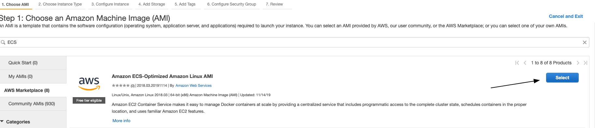
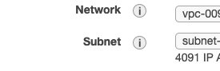
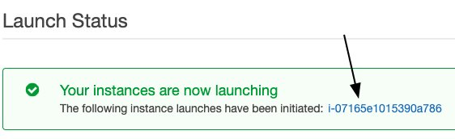
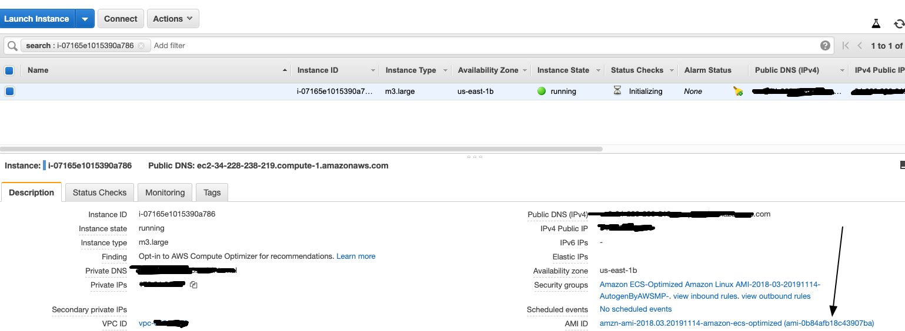

# Step 3: Start Cluster

After your jobs have been submitted to the queue, it is time to start your cluster.
Once you have configured your spot fleet request per the instructions below, you may run
`python run.py startCluster files/{YourFleetFile}.json`

When you enter this command, the following things will happen (in this order):

* Your spot fleet request will be sent to AWS.
Depending on their capacity and the price that you bid, it can take anywhere from a couple of minutes to several hours for your machines to be ready.
* Distributed-CellProfiler will create the APP_NAMESpotFleetRequestId.json file, which will allow you to [start your progress monitor](step_4_monitor.md).
This will allow you to walk away and just let things run even if your spot fleet won't be ready for some time.

Once the spot fleet is ready:

* Distributed-CellProfiler will create the log groups (if they don't already exist) for your log streams to go in.
* Distributed-CellProfiler will ask AWS to place Docker containers onto the instances in your spot fleet.
Your job will begin shortly!

***
## Configuring your spot fleet request
Definition of many of these terms and explanations of many of the individual configuration parameters of spot fleets are covered in AWS documentation [here](http://docs.aws.amazon.com/AWSEC2/latest/UserGuide/spot-fleet.html) and [here](http://docs.aws.amazon.com/cli/latest/reference/ec2/request-spot-fleet.html).
You may also configure your spot fleet request through Amazon's web interface and simply download the JSON file at the "review" page to generate the configuration file you want, though we do not recommend this as Distributed-CellProfiler assumes a certain fleet request structure and has only been tested on certain Amazon AMI's.
Looking at the output of this automatically generated spot fleet request can be useful though for obtaining values like your VPC's subnet and security groups, as well the ARN ID's of your roles.

Among the parameters you should/must update:

* **The IamFleetRole, IamInstanceProfile, KeyName, SubnetId, and Groups:** These are account specific and you will configure these based on the [previous setup work that you did](step_0_prep.md).
Once you've created your first complete spot fleet request, you can save a copy as a local template so that you don't have to look these up every time.

  * The KeyName used here should be the same used in your config file but **without** the `.pem` extension.

* **ImageId and SnapshotId** These refer to the OS and pre-installed programming that will be used by your spot fleet instances, and are both AWS region specific.
We use the Amazon ECS-Optimized Amazon Linux AMI; but the Linux 2 AMI also seems to work in our limited testing.
If there is no template fleet file for your region, or the one here is too out-of-date, see below for instructions on configuring these options yourselves.
If you have a good working configuration for a region that isn't represented or for a more up-to-date version of the AMI than we've had time to test, please feel free to create a pull request and we'll include it in the repo!

## Parameters that must be configured in the spot fleet in DCP 1 (but not current versions)
These parameters were present in the spot fleet request in first version of DCP but not subsequent versions.
We provide the information here because we have not officially deprecated DCP 1, however we strongly encourage you to use a more updated version.

* **ValidFrom and ValidTo:**  These should be set such that the current date is between them, and no more than 1 year apart.
* **TargetCapacity:**  The number of instances you want.
You must make sure it aligns with the specifications from your (config file)[step_1_configuration.md.
* **InstanceType:** The type of instances you want.
You must make sure it aligns with the specifications from your (config file)[step_1_configuration.md.
* **SpotPrice:** The maximum price per hour you're willing to pay for each instance.  
AWS has a handy [price history tracker](https://console.aws.amazon.com/ec2sp/v1/spot/home) you can use to make a reasonable estimate of how much to bid.
If your jobs complete quickly and/or you don't need the data immediately you can reduce your bid accordingly.
Jobs that may take many hours to finish or that you need results from immediately may justify a higher bid.

## To run in a region where a spot fleet config isn't available or is out of date:

* Under EC2 -> Instances select "Launch Instance"

* Search "ECS", then choose the "Amazon ECS-Optimized Amazon Linux AMI"

* Select Continue, then select any instance type (we're going to kill this after a few seconds) and click "Next: Configure Instance Details"

* Choose a network and subnet in the region you wish to launch instances in, and then click "Next: Add Storage"

* On the "Add Storage" page, note down the Snapshot column for the Root volume- this is your SnapshotId.
Click "Review and Launch"

* Click "Launch", and then select any key pair (again, we'll be killing this in a few seconds)

* Once your instance has launched, click its link from the launch page.

* In the list of information on the instance, find and note its AMI ID - this is your ImageId

* Terminate the instance
